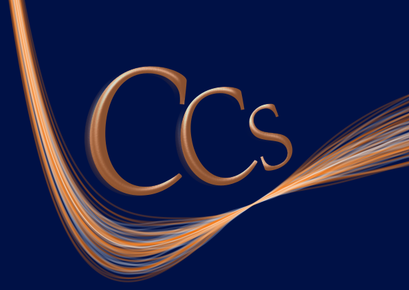

# CCS_fit - Fitting using Curvature Constrained Splines  

[](https://pypi.org/project/ccs-fit/)
[](https://opensource.org/licenses/LGPL-3.0)
[](https://doi.org/10.1016/j.cpc.2020.107602)
[](https://github.com/Teoroo-CMC/CCS/actions)
[](https://teoroo-cmc.github.io/CCS/)
[](https://pypi.org/project/ccs-fit/)

<!--- [](https://github.com/tblite/tblite/actions)
[](https://github.com/Teoroo-CMC/CCS/releases/latest)
[](https://teoroo-cmc.github.io/CCS/)
[](https://codecov.io/gh/tblite/tblite) 
[(https://github.com/Teoroo-CMC/CCS/actions)
--->



The `CCS_fit` package is a tool to construct two-body potentials using the idea of curvature constrained splines.
## Getting Started
### Package Layout

```
ccs_fit-x.y.z
├── CHANGELOG.md
├── LICENSE
├── MANIFEST.in
├── README.md
├── bin
│   ├── ccs_build_db
│   ├── ccs_export_sktable
|   ├── ccs_export_FF
│   ├── ccs_fetch
│   ├── ccs_fit
│   └── ccs_validate
├── docs
├── examples
│   └── Basic_Tutorial
│       └── tutorial.ipynb
│   └── Advanced_Tutorials
│       ├── CCS
│       ├── CCS_with_LAMMPS
│       ├── DFTB_repulsive_fitting
│       ├── ppmd_interfacing
│       ├── Preparing_ASE_db_trainingsets
│       ├── Search_mode
│       └── Simple_regressor
├── logo.png
├── poetry.lock
├── pyproject.toml
├── src
│   └── ccs
│       ├── ase_calculator
│       ├── common
│       ├── data
│       ├── debugging_tools
│       ├── fitting
│       ├── ppmd_interface
│       ├── regression_tool
│       └── scripts
│           ├── ccs_build_db.py
│           ├── ccs_export_FF.py
│           ├── ccs_export_sktable.py
│           ├── ccs_fetch.py
│           ├── ccs_fit.py
│           └── ccs_validate.py
└── tests
```

* `ccs_build_db`        - Routine that builds an ASE-database.
* `ccs_fetch`           - Executable to construct the traning-set (structures.json) from a pre-existing ASE-database.
* `ccs_fit`             - The primary executable file for the ccs_fit package.
* `ccs_export_sktable`  - Export the spline in a dftbplus-compatible layout.
* `ccs_export_FF`       - Fit the spline to commonly employed force fields; Buckingham, Morse and Lennard Jones.
* `ccs_validate`        - Validation of the energies and forces of the fit compared to the training set.
* `main.py`             - A module to parse input files.
* `objective.py`        - A module which contains the objective function and solver.
* `spline_functions.py` - A module for spline construction/evaluation/output. 

<!---
### Prerequisites

You need to install the following softwares
```
pip install numpy
pip install scipy
pip install ase
pip install cvxopt
```
### Installing from source

#### Git clone

```
git clone git@github.com/Teoroo-CMC/CCS.git
cd CCS
python setup.py install
```
--->

### (Recommended) installing from pip
```
pip install ccs_fit
```

### Installing from source using poetry
```
git clone https://github.com/Teoroo-CMC/CCS_fit.git ccs_fit
cd ccs_fit

# Install python package manager poetry (see https://python-poetry.org/docs/ for more explicit installation instructions)
curl -sSL https://install.python-poetry.org | python3 -
# You might have to add poetry to your PATH
poetry --version # to see if poetry installed correctly
poetry install # to install ccs_fit
```
<!---
### Environment Variables
Set the following environment variables:
```
$export PYTHONPATH=<path-to-CCS-package>:$PYTHONPATH
$export PATH=<path-to-CCS-bin>:$PATH

Within a conda virtual environment, you can update the path by using:
conda develop <path-to-CCS-package>
```
--->

## Tutorials

We provide tutorials in the [examples](examples/) folder. To run the example, go to one of the folders. Each contain the neccesery input files required for the task at hand. A sample `CCS_input.json` for O2 is shown below:
```
{
        "General": {
                "interface": "CCS"
        },
        "Train-set": "structures.json",
        "Twobody": {
                "O-O": {
                        "Rcut": 2.5,
                        "Resolution": 0.02,
                        "Swtype": "sw"
                }
        },
        "Onebody": [
                "O"
        ]
}

```
The `CCS_input.json` file should provide at a minimum the block "General" specifying an interface. The default is to look for input structures in the file `structure.json` file. The format for `structure.json` is shown below :
```
{
"energies":{
        "S1": {
                "Energy": -4.22425752,
                "Atoms": {
                        "O": 2
                },
                "O-O": [
                        0.96
                ]
        },
        "S2": {
                "Energy": -5.29665634,
                "Atoms": {
                        "O": 2
                },
                "O-O": [
                        0.98
                ]
        },
        "S3": {
                "Energy": -6.20910363,
                "Atoms": {
                        "O": 2
                },
                "O-O": [
                        1.0
                ]
        },
        "S4": {
                "Energy": -6.98075271,
                "Atoms": {
                        "O": 2
                },
                "O-O": [
                        1.02
                ]
        }
}
}
```
The `structure.json` file contains different configurations labeled ("S1", "S2"...) and corresponding energy, pairwise distances (contained in an array labelled as "O-O" for oxygen). The stoichiometry of each configuration is given under the atoms label ("Atoms") as a key-value pair ("O" : 2 ). 


To perform the fit : 
```
ccs_fit
```
The following output files are obtained:
```
CCS_params.json CCS_error.out ccs.log 
```
* CCS_params.json  - Contains the spline coefficients, and one-body terms for two body potentials.
* error.out        - Contains target energies, predicted energies and absolute error for each configuration.
* ccs.log          - Contains debug information
## Authors

* **Akshay Krishna AK** 
* **Jolla Kullgren** 
* **Eddie Wadbro** 
* **Peter Broqvist**
* **Thijs Smolders**

## Funding
This project has received funding from the European Union's Horizon 2020 research and innovation programme under grant agreement No 957189, and the Swedish National Strategic e-Science programme eSSENCE.

## License
This project is licensed under the GPLv3 License - see the [LICENSE](LICENSE) file for details.

## Acknowledgement
We want to thank Pavlin Mitev, Christof Köhler, Matthew Wolf, Kersti Hermansson, Bálint Aradi and Tammo van der Heide, and all the members of the [TEOROO-group](http://www.teoroo.kemi.uu.se/) at Uppsala University, Sweden for fruitful discussions and general support.
